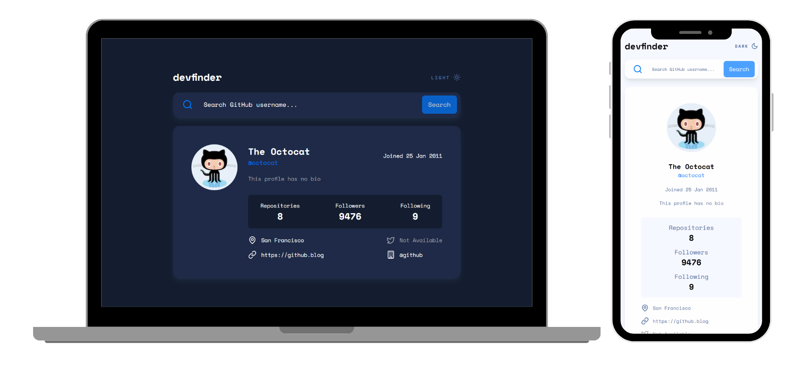

<h1 align="center" style="font-weight: bold;">GitHub Search User 😺🔎</h1>

<p align="center">
  <a href="#technologies">Technologies</a> • 
  <a href="#started">Getting Started</a> • 
  <a href="#contact">Contacts</a>
</p>

<p align="center">
  <b>A website that fetches GitHub users and displays some of their information.</b>
</p>

<p align="center">
  <a href="https://github-search-user-eight.vercel.app/">🔗 Visit this Project</a>
</p>

<h2 id="layout">🎨 Layout</h2>

<p align="center">
  
</p>

<h2 id="technologies">💻 Technologies</h2>

- React
- Next.js
- TypeScript
- TailwindCSS
- Axios
- React Loading Skeleton
- Lucide Icons

<h2 id="started">🚀 Getting started</h2>

<h3>You need to install <a href="https://nodejs.org/en/download/">NodeJS</a> or <a href="https://yarnpkg.com/">Yarn</a> first, then in order to clone the project via HTTPS, run this command:</h3>

```bash
git clone https://github.com/joaoliveirapb/github-search-user.git
```

<h3>Install dependencies</h3>

```bash
npm install
```

<h3>Start development server</h3>

```bash
npm run dev
```
<h2 id="contact">✉️ Contacts</h2>

Made by [João Oliveira](https://github.com/joaoliveirapb) 🚀🚀

> Email: [joaoliveira.batista1@gmail.com](mailto:joaoliveira.batista1@gmail.com) • 
> LinkedIn: [João Oliveira](https://www.linkedin.com/in/joao-oliveira-preto-batista/) • 
> GitHub: [@joaoliveirapb](https://github.com/joaoliveirapb)
